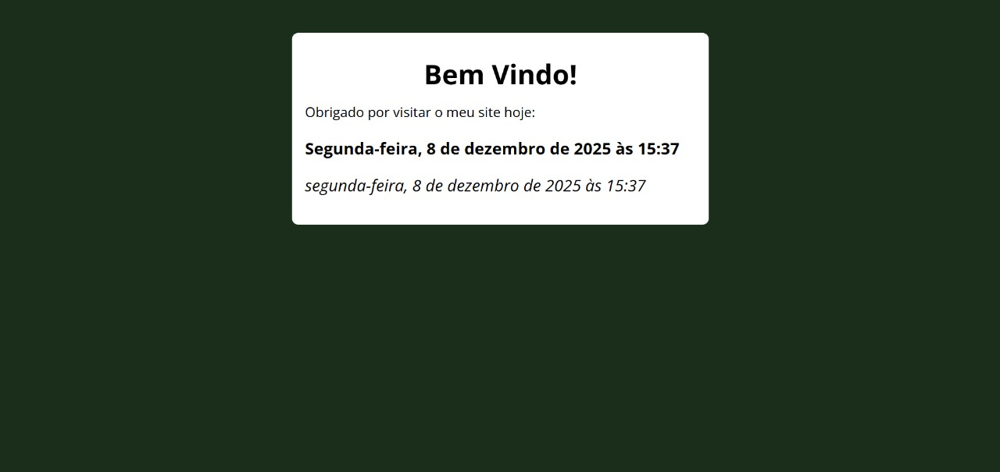

# 🕒 Data e Hora - Exercício JS

## 📌 Descrição
Exercício de **JavaScript** que exibe a **data e o horário exato** em que o usuário acessa ou atualiza a página.  
A informação é mostrada **duas vezes**, utilizando **dois métodos diferentes** de código — como parte de um desafio proposto pelo professor.

> Toda vez que a página é carregada, os valores são atualizados automaticamente com a data e hora atual.

---

## 🛠️ Tecnologias utilizadas
- HTML5
- CSS3
- JavaScript (JS)

---

## 📸 Preview


---

## 🚀 Como visualizar

Você pode abrir o projeto localmente:

1. Baixe ou clone este repositório:
   - Clique em **Code > Download ZIP** e extraia os arquivos  
   - ou use o comando:
     ```bash
     git clone https://github.com/WellingthonSchuh/Data-e-Hora.git
     ```

2. Abra o arquivo `index.html` em qualquer navegador moderno.

Ou

1. Acesse o site:
   - https://wellingthonschuh.github.io/Timer/

> ⚠️ O projeto é totalmente seguro. Nenhum dado é armazenado — o JavaScript apenas exibe a data e hora local do dispositivo.

---

## 📚 Aprendizados
- Manipulação de datas e horários com JavaScript
- Uso de `Date()` e formatação personalizada
- Atualização dinâmica de conteúdo na página
- Comparação entre diferentes abordagens para resolver o mesmo problema

---

## 👨‍💻 Autor
Feito por **Wellingthon Schuh**  
🔗 [LinkedIn](https://www.linkedin.com/in/wellingthonschuh)
